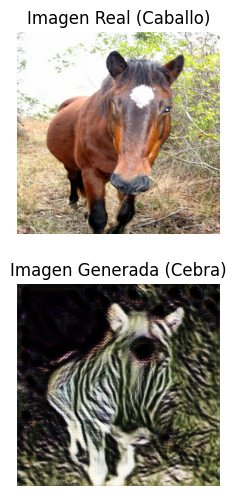

# Proyecto de investigación: CycleGAN con horse2zebra

Este proyecto explora la implementación y aplicación de **CycleGAN** para la traducción de imágenes utilizando el dataset *horse2zebra*. El objetivo es transformar imágenes de caballos en cebras y viceversa, sin necesidad de contar con pares de imágenes emparejadas. También, se investigará sobre las CycleGan mostrando su contexto histórico, características, arquitectura y aplicaciones.
**La documentación está incluida en el cuaderno de Colab junto con el código**.

<a href="./img/portada.png">
  
</a>

## Tabla de Contenidos

- [Introducción](#introducción)
- [Descripción del proyecto](#descripción-del-proyecto)
- [Estructura del repositorio](#estructura-del-repositorio)
- [Cuaderno de Colab](#cuaderno-de-colab)
- [Resultados](#resultados)
- [Conclusiones](#conclusiones)
- [Referencias bibliográficas](#referencias-bibliográficas)

## Introducción

CycleGAN representa un avance significativo en la traducción de imágenes, ya que permite aprender mapeos entre dos dominios visuales sin necesidad de contar con datos emparejados. La clave de esta arquitectura es la **pérdida de consistencia cíclica**, que garantiza que una imagen transformada de un dominio a otro y de vuelta, se asemeje a la original.

## Descripción del proyecto

En este proyecto se ha implementado CycleGAN para transformar imágenes de caballos en imágenes de cebras, utilizando el dataset *horse2zebra*. El proyecto consta de:

- **Generadores**: dos modelos, `generator_g.h5` y `generator_f.h5`, encargados de aprender la traducción entre los dominios.
- **Discriminadores**: dos modelos, `discriminator_x.h5` y `discriminator_y.h5`, que evalúan la autenticidad de las imágenes generadas en cada dominio.
- **Resultados Visuales**: las imágenes generadas se encuentran en la carpeta `img` bajo el nombre `generadas.png`.

## Estructura del repositorio

```plaintext
├── models
│   ├── generator_g.h5
│   ├── generator_f.h5
│   ├── discriminator_x.h5
│   └── discriminator_y.h5
├── img
│   ├── portada.png
│   └── generadas.png
├── Investigacion_GAN_German_Garcia_Estevez.ipynb   # Cuaderno de Colab incluido en el repositorio con la documentación
└── README.md
```

## Cuaderno de colab

[Abrir en Google Colab](https://colab.research.google.com/drive/1P0Z_nIeK0PnU-AejmH845JMGGAhtEN_8?usp=sharing)

El cuaderno de Colab contiene el flujo completo del proyecto, incluyendo:

- Preprocesamiento del dataset *horse2zebra*.
- Definición y compilación de los modelos (generadores y discriminadores).
- Entrenamiento de la red con la pérdida de consistencia cíclica.
- Visualización y guardado de las imágenes generadas.

## Resultados

Las imágenes `generada_x.png` que están la carpeta `img`, muestran un ejemplo de las transformaciones de varias imágenes de caballo a cebra (o viceversa) lograda mediante la arquitectura CycleGAN.

Las transformaciones en este caso son muy pobres, apenas apreciandose cualquier parecido a una cebra. Esto es debido al bajo número de épocas (5), pues la capacidad de cómputo de Google Colab no dejaba mucho más juego. Para obtener mejores resultados, se recomienda subir a 50 e incluso a 100 épocas, entre otros cambios para mejorar el procesamiento.

<a href="./img/generada_1.png">
  
</a>

<a href="./img/generada_2.png">
  
</a>

<a href="./img/generada_2.png">
  
</a>

## Conclusiones

CycleGAN representa un avance significativo en la traducción de imágenes sin la necesidad de datos emparejados, gracias a la introducción de la pérdida de consistencia cíclica.

Su arquitectura dual (dos generadores y dos discriminadores) le permite aprender transformaciones complejas entre dominios, manteniendo la estructura esencial de las imágenes.

Las aplicaciones de CycleGAN son muy variadas, abarcando desde la transferencia de estilos artísticos hasta mejoras en imágenes y aplicaciones médicas.

## Referencias Bibliográficas

- Zhu, J.-Y., Park, T., Isola, P., & Efros, A. A. (2017). [CycleGAN: A Method for Unpaired Image-to-Image Translation](https://arxiv.org/abs/1703.10593)
- Tutorial oficial de TensorFlow sobre CycleGAN [Tutorial oficial de TensorFlow sobre CycleGAN](https://www.tensorflow.org/tutorials/generative/cyclegan)
- Diagrama [Foto del diagrama](https://www.researchgate.net/figure/The-Architecture-of-CycleGAN-adopted-from-37_fig5_383575896)
